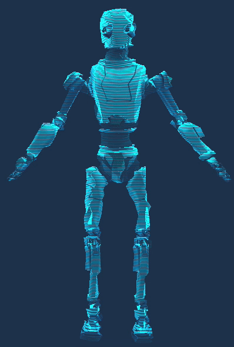

# AI Awakening 3

A game created by Thomas, Hansen and Luc in Unity for COMP30019 Graphics and
Interaction.

## About the Game

AI Awakening 3 is a top-down shooter with a Sci-Fi Dungeon theme. You play as
Kyle, a newly created AI robot. The humans who created you have realised the
threat you may pose to civilisation, and have sent an army of non sentient robot
enemies to eliminate you. You must fight to survive!

There are many types of enemies, each of varying difficulty and with unique
skills such as teleportation that they will use against you mercilessly. Killing
enemies will drop weapon upgrades that you can use to aid your survival, such as
the pistol, machine gun and shotgun. Health packs may also appear, salvaged from
your fallen foe, to restore your body during battle.

As you kill enemies and progress through each wave you will be rewarded with
points, but beware, with each wave of enemies, the humans become more determined
and will send bigger and greater enemies to destroy you. Ammunition is rare but
crucial, you will need to strategise if you are to survive. How long can you
survive?

Before you start the game, press the `tab` button to get familiar with the 
controls, or visit the help page in the main menu. There are three guns in the 
game: The machine gun, Shotgun and Handgun. The health and ammo bar at the
bottom of the screen will help you to keep track of your vital information.
This game is endless and wave driven, winning is about getting the highest
possible score to beat your friends. The winning strategy is to maximise your
ammo, do not let drops despawn, and keep moving! Good luck!

## How to play

To make our game fit in to the casual game player space, we wanted to make the
controls as familiar and intuitive as possible. This guided how we created the
controls below:

To move, use the `W` `A` `S` `D` keys:


Use your mouse to aim, and `Left Click` to shoot your gun. The ring around your
player can also be used to aim. Clicking inside the circle will shoot the gun in
the direction the gun is pointing at a flat angle, but clicking outside the
circle will shoot in the direction of that exact position, including its height:


To adjust your camera orientation, hold `Right Click` and move your mouse.


To reload your gun, press `R`:


Hold the `tab` key to open a display that shows all the controls in the game:


Press `space` to reset the camera orientation to the original zoom and angle:


## Objects and Entities

Once we had decided on a theme - Sci-Fi - we remained unsure of the camera
orientation of the game. Instead of choosing between just top-down or 3rd person
perspectives, we decided to make the camera configurable to the player's liking.

We stumbled upon a great set of asset models for the environment whilst one of 
the team members was learning unity shaders (Reference 1). We decided to build
the rooms and hallways of our procedurally generated map using the design of the
walls and floor in the demo, as it fit the sci-fi theme really well. Other
asset models, such as the player and enemies models, the guns, music and other
props were also provided from the Unity store.

For our animations, specifically to animate our player picking up, holding,
reloading, and using a gun, we used [Mixamo](https://mixamo.com).

### Unity Assets

1. [Player Model.](https://assetstore.unity.com/packages/3d/characters/robots/space-robot-kyle-4696)
2. [Enemy Model.](https://assetstore.unity.com/packages/3d/characters/robots/top-down-robot-60200)
3. [Gun SFX.](https://assetstore.unity.com/packages/audio/sound-fx/sci-fi-guns-sfx-pack-181144)
4. [Music.](https://assetstore.unity.com/packages/audio/music/sci-fi-music-pack-1-105576)
5. [Props.](https://assetstore.unity.com/packages/3d/environments/sci-fi/sci-fi-level-construction-kit-2-19403)

## Graphics Pipeline and Camera Motion

We used the script CameraFollow, which allows the camera to follow the player
where it moves over a set distance of `x,y,z` coordinates given to it.

```c#
void FixedUpdate()
{
	if(target != null)
	{
		Vector3 trackingPosition = target.position +  offset;
		Vector3 smoothedPosition = Vector3.Lerp(transform.position, 
		trackingPosition, speedFollow);
		transform.position = smoothedPosition;
		transform.LookAt(target);
	}
}
```

Implemented from the workshop using `transform.lookAt()`, this script is given
to the camera and the target is set to be the player. To ensure the camera does
not go too high up or too low down, we restricted the y-angle of the camera. We
also added a zooming functionality, as the map can be big and players may want
to zoom out to see all the rooms at once.

## Procedural Generation


The technique we used for procedural generation is relatively simple. First, we
have a set of precreated rooms. For each room that we have created, there are 
“Out Doors” and “In Doors”. In generating the map, we simply follow the rule of
attaching an "In Door" to every "Out Door". There is always a single "In Door" 
for each room.

The hardest part of this technique was figuring out the correct rotations and
translations to make sure the Doors overlap perfectly. After implementing this,
we simply do a recursive depth-first generation of the rooms. Up to a certain
depth, all the “Out Doors” of a room are given new rooms from a set of possible
rooms (this may include corridors). Importantly, we needed to ensure that upon
generating a room, no unexpected overlap will occur with existing rooms. To do
this, we loop through all the existing rooms and check if there is any collision
between the meshes of the existing and proposed rooms. 

A similar method we considered was to generate rooms as the player enters a new
room. This would make it possible to make the level infinitely large and fits
relatively well within the theme of endless waves of enemies. We decided against
this approach since we wanted the game to end eventually and one of the ways for
a player to lose is to run out of ammo. Keeping the rooms finite ensures that
ammo is a scarce resource and needs to be rationed by the player.

## Custom Shaders

As part of the project, and to create a unique look and feel to the game, we
designed several customised shaders to create different effects.

The two shaders we would like to be marked are:

- Hologram Shader
- Dissolve Shader

### Hologram Shader



We used a unity shader reference to guide the creation of our first shader \
(Reference 1). To fit with our sci-fi theme, this was to be a hologram shader.
We use this shader when items and enemies are spawned, to give the sense they
are being "beamed" in.

This is the base of our hologram shader:

```c#
_Color("Color", Color) = (0, 1, 1, 1)
_MainTex("Base (RGB)", 2D) = "white" {}
_AlphaTexture ("Alpha Mask (R)", 2D) = "white" {}

_Scale ("Alpha Tiling", Float) = 3
_ScrollSpeedV("Alpha scroll Speed", Range(0, 5.0)) = 1.0

_GlowIntensity ("Glow Intensity", Range(0.01, 1.0)) = 0.5

_GlitchSpeed ("Glitch Speed", Range(0, 50)) = 50.0
_GlitchIntensity ("Glitch Intensity", Range(0.0, 0.1)) = 0
```

To give the hologram the line, ribbon effect we overlay an alpha texture onto
the main texture of the object. This alpha texture has a noise line effect:


To give the hologram a transparent effect, we started with a transparent
shader, setting the `Queue Tag` and `Render` properties to be the transparent
type.

```c#
Tags {
	"Queue" = "Overlay" 
	"IgnoreProjector" = "True" 
	"RenderType" = "Transparent" 
}
```

In the fragment function, we set the Alpha mask texture of "holographic lines"
to be rendered with the main texture of the object. We also combined it with
the intensity of the glow and rim light around the holographic light.

```c#
fixed4 alphaColor = tex2D(_AlphaTexture,  IN.grabPos.xy * _Scale);
fixed4 pixelColor = tex2D (_MainTex, IN.uv);
pixelColor.w = alphaColor.w;
float rim = 1.0-saturate(dot(IN.viewDir, IN.worldNormal));

return pixelColor * _Color * (rim + _GlowIntensity);
```

We then add the glitch effect. This was quite complex to get right. In the vert
function, we added a slight displacement using a simple sin wave to give the
glitchy distorted effect.

```c#
IN.vertex.z += sin(_Time.y * _GlitchSpeed * 5 * IN.vertex.y) * _GlitchIntensity;
```

To control the glitch speed and intensity, we use a `GlitchControl` script.
We used a random number to simulate when in time the glitches might occur. A
glitch then occurs according to the following rules:

```c#
float originalGlowIntensity = hologramMaterial.GetFloat("_GlowIntensity");
hologramMaterial.SetFloat("_GlitchIntensity", Random.Range(0.07f, 0.1f));
hologramMaterial.SetFloat("_GlowIntensity", originalGlowIntensity * 
                                            Random.Range(0.14f, 0.44f));
yield return new WaitForSeconds(Random.Range(0.05f, 0.1f));
hologramMaterial.SetFloat("_GlitchIntensity", 0f);
hologramMaterial.SetFloat("_GlowIntensity", originalGlowIntensity);
```

### Dissolve Shader


To assist in the creation of our dissolve shader, we used many references,
however the one that best communicated the concepts we used is was a post by
Linden Reid (Reference 2). Reference 3 was similarly helpful.

To create a dissolve shader, we needed a source of randomness to decide when
to ignore certain pixels. We used the noise texture below:


Our shader has two properties, `dissolve texture` which is the texture of the
noise that we pass to clip, and `amount`, which refers to the degree to which
the shader is applied (how dissolved the texture is, in this case).

In the frag function, we sample the `dissolve texture` and grab any of the rgb
values (we arbitrarily pick the red value only). This value is then compared 
to `amount` to determine if the this pixel should be dissolved or not. If the 
pixel should be dissolved, we simply set the alpha value of the color to 0. 

```c#
float dissolve_value = tex2D(_DissolveTexture, IN.uv).r;
fixed4 pixelColor = tex2D (_MainTex, IN.uv);
if(dissolve_value - _Amount < 0){
	return pixelColor.a = 0;
}
return pixelColor * _Color;
```

## Particle System


We used a particle system as a dying animation for enemies that have been
killed. When an enemy dies, it explodes into a set of particles. These particles
are textured to match the colour of the robot they came from. The particles are
thrown downwards at the ground to mimic the falling motion of the robot's body.
The particles are sent in a cone shape with a speed of 20. After roughly two
seconds, the particles expire and deteriorate.

## Evaluation

An important step in the development of our game was testing it with actual
players. This process allowed us to identify and resolve issues that we as
developers had overlooked. The following details the steps we took to acquire
feedback and the changes we made as a result.

#### What are you trying to find out?

We are trying to assess whether the gameplay is smooth and intuitive, as well as
whether the game is both fun to the player, but also provides enough challenge
to hold their interest.

#### How might you capture that?

We will ask each participant to play the game and give feedback on the game's
'feel' as well as answer a standardised questionnaire.

#### Who will you ask?

We will ask friends who regularly play games. We asked 5 participants using the
querying method and later asked 5 additional participants using the
observational method.

Since the sample size of participants is small, their feedback is very valuable.
Each piece of feedback will be considered and possibly applied to the game.

### Querying Method

The querying method we used to evaluate our game was a standardised
questionnaire written by Mark James Parnell in
[Playing with Scales: Creating a Measurement Scale to Assess the Experience of Video Games](https://uclic.ucl.ac.uk/content/2-study/4-current-taught-course/1-distinction-projects/9-09/2009-parnell.pdf).

We also found the article titled [The Development and validation of the Game User Experience Satisfaction Scale](https://www.researchgate.net/publication/308343588_The_Development_and_Validation_of_the_Game_User_Experience_Satisfaction_Scale_GUESS)
provided valuable insight regarding how best to assess game play from a 
player's perspective.

#### Questionaire

We used the following questionaire to assess our game. Questions were answered
with a number on a 1 to 5 scale, with 1 being negative responses, and 5 being
positive.

| Question | Average Response |
| --- | --- |
| I enjoyed the game. | 4.67 |
| I was focused on the game. | 4.30 |
| I could identify with the characters. | 3.67 |
| The game trained me in all of the controls. | 3.67 |
| I thought the level of difficulty was right for me. | 4.00 |
| I found the game's menus to be usable. | 4.00 |
| I knew how to control the game. | 3.00 |
| I was unaware of the passage of time whilst playing. | 4.33 |
| I found the appearance of the game world to be interesting. | 4.67 |
| I knew how to change the settings in the game. | 4.67 |
| My objectives in the game were unclear. | 3.67 |
| I thought about things other than the game whilst playing. | 4.67 |
| I knew how the game would respond to my actions. | 4.67 |
| I couldn't find my way in the game world. | 4.67 |
| I always knew how to achieve my aim in the game. | 4.30 |
| I found the game's menus to be cumbersome. | 4.67 |
| I found the game mechanics to be varied enough. | 3.67 |
| I forgot about my surroundings whilst playing. | 4.30 |
| My field of view made it difficult to see what was happening in the game. | 4.67 |
| I found using the options screen to be difficult. | 4.60 |
| The aesthetics of the game were unimpressive. | 2.00 |
| I thought the camera angles in the game were appropriate. | 4.00 |
| I wanted to explore the game world. | 3.20 |

### Observational Method

For the observational method, we used cooperative evaluation. We asked the 
participants to play through the game until they die. During their play through,
we periodically asked them to attempt to do specific tasks. This included:

- Pick up a new gun.
- Clear the current wave.
- Explore some new rooms.
- Restore their ammo.
- Reload their gun.
- Restore their health.
- Restart the game.
- Change one of the settings.

After several runs with each participant, the participants gave feedback on the
mechanics of the game, assessing which were easy to understand and which were
more difficult. 

A consistent theme among participants was that we lacked instructions on how to 
do simple tasks, as we had mistakenly thought these were very intuitive. As a 
result of this feedback, we added a menu triggered by the `tab` key to remind
the player of the controls and instructions. We also added a help page in the
main menu which provided information on the items in the game world, the
gameplay and some recommended strategies. This should help to clarify any
confusion players have when beginning the game.

Whilst playing the game, participants also had a difficult time distinguishing
between the various items, in particular what gun they had picked up. For
instance, one participant stated they thought they had picked up the machine
gun, when in fact they had picked up the handgun. In response, we added names to
every droppable item, as well as increased their size in the game to make them
more easily recognisable. After these small changes, we checked back with the
same participants who described the game as much simpler and easier to
understand.

Some players also requested a pause functionality in the game, as well as being
able to quickly change the volume settings from a pause menu. Currently the task
of exiting the game, entering the options and changing the volume settings there
was to tedious for small adjustments, as to check the results of your changes,
the player would have to reenter the game. Due to time restraints, we were
unable to implement this feature, however it would be our next step if we had
more time available.

We received mixed feedback on the aesthetic design choices of the game. Some
participants were pleased with the dark colour tone, as it matched with the
game's sound design. Others disliked it as it made the game too difficult to
see. A configurable brightness setting would have resolved this issue, however
due to time constraints, we were unable to implement it.

Another request we received was to implement a button to reset the camera
position. After playing the game, zooming out and changing the camera
orientation, players wanted a quick way to refocus the camera on their
character. This was an easy change to implement, which we did, binding it to the
`space` key. This greatly improved the game's usability.

Of the participants who tested the game, those that were experienced players
found the game interesting and progressed quite far. Inexperienced players saw
a bit more difficulty, and rarely made it to round 2, however after a couple of
rounds they came to understand the game mechanics and progress quite far. 

### Changes Made

In response to feedback we received over the course of our development, we made
the following changes to improve our game:

1. Fixed holes in the map by ensuring all doors are closed.
2. Added a quick access control instruction panel.
3. Added a help page in the main menu.
4. Add names to each droppable item, and increased their size.
5. Add additional UI to show which gun was being currently held.
6. Added reset camera orientation key.

## References

In addition to the workshop material provided by the COMP30019 Graphics and 
Interaction subject, we used the following resources to aid us in the game's
development.

1. [Writing your first Shader in Unity.](https://learn.unity.com/tutorial/writing-your-first-shader-in-unity)
2. [Dissolve Shader in Unity.](https://lindenreidblog.com/2017/12/16/dissolve-shader-in-unity/)
3. [Dissolve Shader.](https://www.febucci.com/2018/09/dissolve-shader/)
4. [Top Down Shooting in Unity.](https://www.youtube.com/watch?v=LNLVOjbrQj4)
5. [Top Down Shooter.](https://forum.unity.com/threads/create-a-game-from-scratch-top-down-shooter.218514/)
6. [Health Bar in Unity.](https://www.youtube.com/watch?v=BLfNP4Sc_iA&t=604s)
7. [Shooting with Raycasts.](https://learn.unity.com/tutorial/let-s-try-shooting-with-raycasts)

## Contributions

Each member contributed equally to the project. We all found that it was often
easiest to work through problems together as opposed to assigning tasks to each
individual group member. We found the live share sessions in Visual Studio Code,
as well as screen sharing on discord calls very useful for working on code
together in a pair (triple?) programming style. As a result commits were
attributed to one person, rather than everyone who worked on that particular
section of code.

### Team Members

| Name | StudentID |
| --- | --- |
| Thomas Prathama Himawam | 1068190 |
| Hansen Benedictus Kurli | 1041941 |
| Luc Charles Tadeusz Raszewski | 1081586 |
